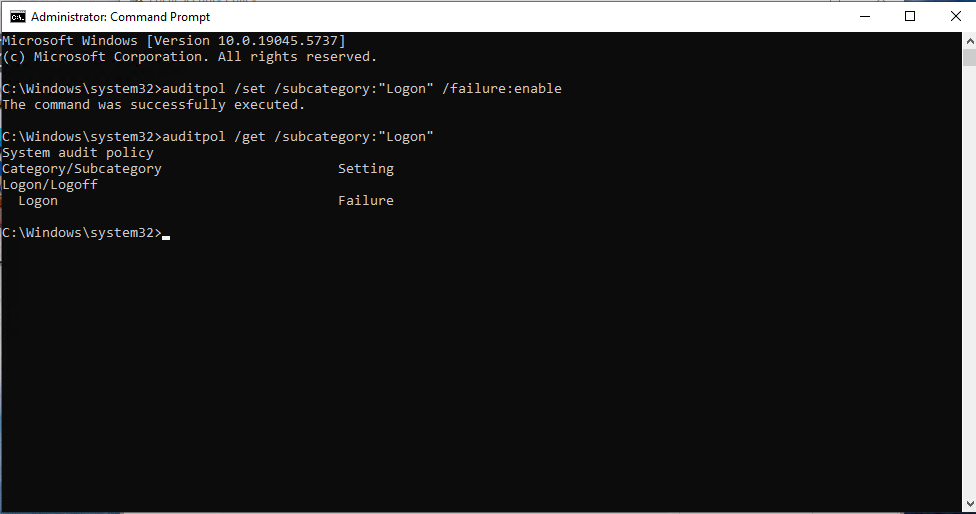
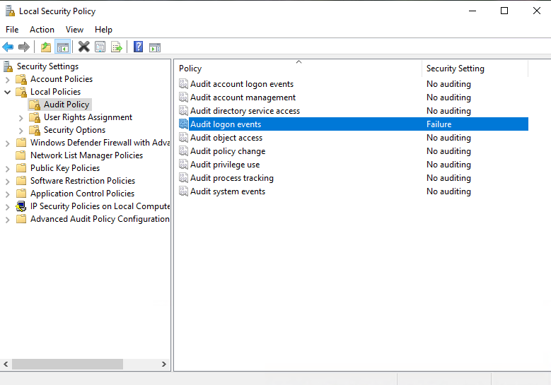
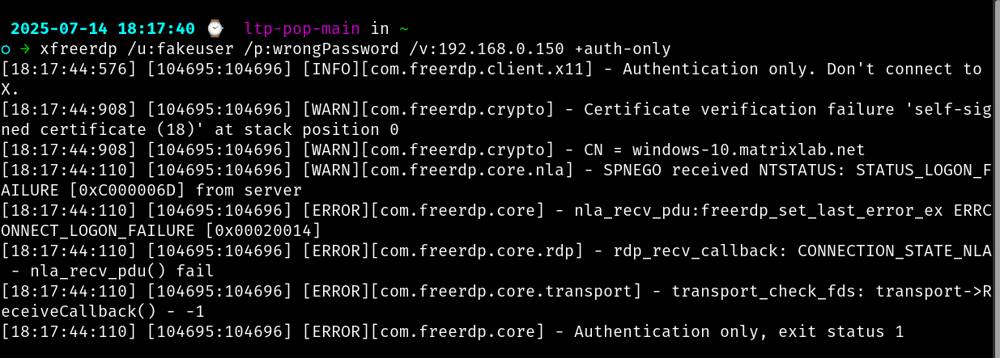
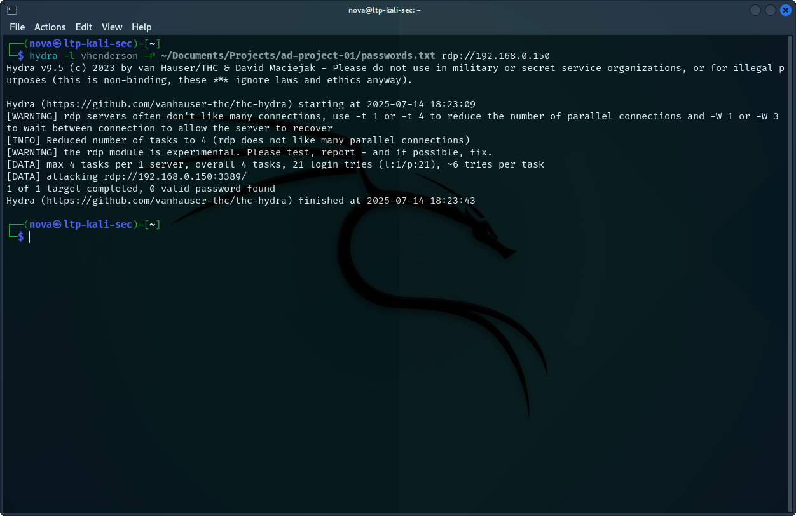
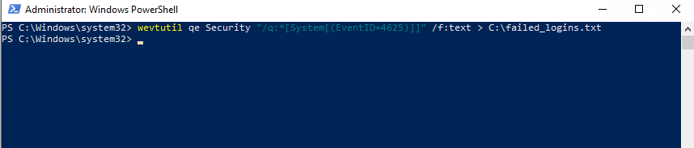
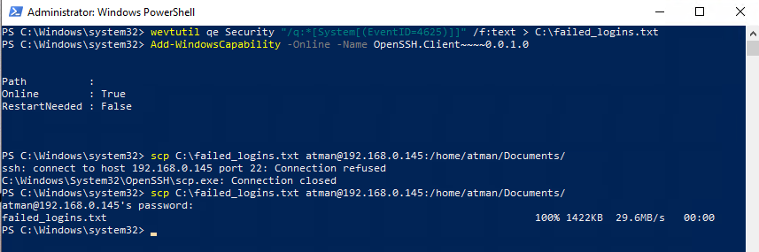
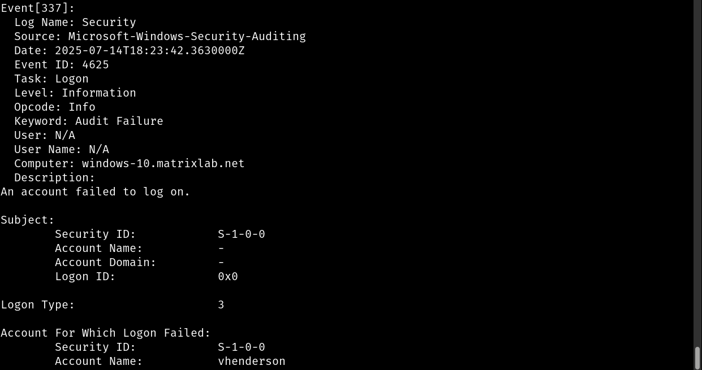

# Day 1: Windows Log Collection Setup

> **Objective:**
> Set up a Windows VM to collect and export security event logs—specifically failed login attempts (Event ID 4625)—triggered by simulated attacks from Kali Linux.

---

## 📦 Prerequisites

Ensure the following lab setup is ready before proceeding:

* ✅ **Proxmox Virtualization Environment** with:

  * A **Windows 10/11 or Server VM** (target for log collection)
  * A **Kali Linux VM** (used to simulate attacks)
* ✅ **Python 3.10+** installed (on analysis VM or Kali)
* ✅ A **VirusTotal API Key**

  * Sign up for a free tier: [VirusTotal Signup](https://www.virustotal.com)

---

## 🛠️ Step 1: Enable Windows Security Auditing

### 🎯 Goal

Ensure Windows logs failed login attempts (Event ID `4625`).

### 🔹 Option A: Via Local Security Policy (GUI)

1. Press `Win + R`, type `secpol.msc`, and press **Enter**.
2. Navigate to:

   ```
   Security Settings > Local Policies > Audit Policy
   ```
3. Double-click **"Audit logon events"**.
4. Check **Failure** (and optionally **Success**).
5. Click **Apply** > **OK**.



---

### 🔹 Option B: Via PowerShell (Recommended)

```powershell
# Enable auditing for failed logon attempts
auditpol /set /subcategory:"Logon" /failure:enable
```

**Verify the setting:**

```powershell
auditpol /get /subcategory:"Logon"
```


---

## 🧪 Step 2: Simulate Failed Logins from Kali Linux

### 🎯 Goal

Trigger Event ID `4625` by simulating unauthorized login attempts.

### 🔹 Option A: Simulate via `xfreerdp`

1. Install `xfreerdp` if needed:

   ```bash
   sudo apt update && sudo apt install freerdp2-x11 -y
   ```

2. Attempt a failed RDP login:

   ```bash
   xfreerdp /v:[Windows_VM_IP] /u:fakeuser /p:wrongpass +auth-only
   ```

> 📝 Replace `[Windows_VM_IP]` with your Windows machine's IP address.
> 💥 This triggers a failed login without opening a full RDP session.



---

### 🔹 Option B: Brute-Force Simulation with `hydra`

```bash
hydra -l admin -P /usr/share/wordlists/rockyou.txt rdp://[Windows_VM_IP]
```

> ⚠️ **Note:** Use only in an isolated lab environment. Never run brute-force tools on production networks.



---

## 📤 Step 3: Export Security Logs from Windows

### 🎯 Goal

Extract Event ID `4625` logs for offline analysis.

### 🔹 Using PowerShell

```powershell
# Export failed login logs to a text file
wevtutil qe Security "/q:*[System[(EventID=4625)]]" /f:text > C:\failed_logins.txt

# Optional: Check contents
Get-Content C:\failed_logins.txt
```

📦 **For XML Output:**

```powershell
wevtutil qe Security "/q:*[System[(EventID=4625)]]" /f:xml > C:\failed_logins.xml
```



---

## 🔁 Step 4: Transfer Logs to Kali (Analysis Machine)

### 🔹 Option A: Using SCP

1. Ensure OpenSSH is installed:

   ```powershell
   Add-WindowsCapability -Online -Name OpenSSH.Client~~~~0.0.1.0
   ```

2. Transfer the log file to Kali:

   ```powershell
   scp C:\failed_logins.txt kali@[Kali_IP]:/home/kali/logs/
   ```


---

### 🔹 Option B: Use Shared Folder (via Proxmox)

1. Set up a shared folder between Windows and Kali.
2. Manually copy `failed_logins.txt` to the shared directory.

---

## ✅ Step 5: Verify the Results

### 🔍 On the Windows VM:

* Open **Event Viewer** → **Windows Logs** → **Security**.
* Filter by **Event ID: 4625**.

### 🔍 On Kali:

* Confirm presence of `failed_logins.txt` in `/home/kali/logs/`.

```bash
cat /home/kali/logs/failed_logins.txt
```

.

---

## 📚 References

* 🔗 [Microsoft auditpol Documentation](https://docs.microsoft.com/en-us/windows-server/administration/windows-commands/auditpol)
* 🔗 [VirusTotal API Reference](https://developers.virustotal.com/reference)
