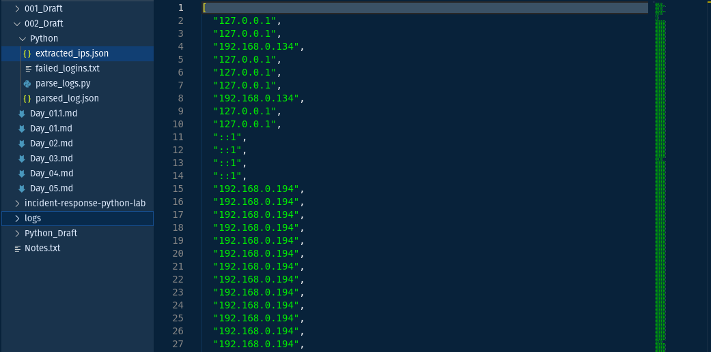
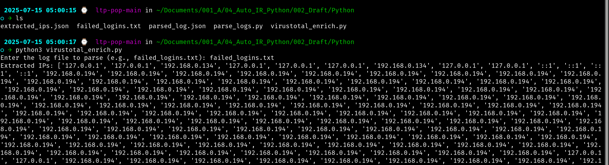
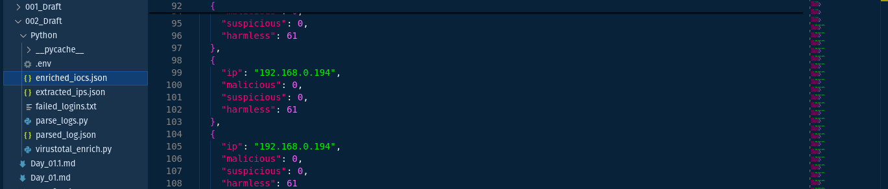

# Day 3: IOC Extraction & VirusTotal Integration

## **🎯 Objective**

1. Extract IOCs (IP addresses) from parsed logs.
2. Enrich IOCs using **VirusTotal’s API** to check for reputation.
3. Save enriched results to JSON for future analysis or alerting.

---

## 📋 Prerequisites

✅ Completed [**Day 2: Log Parsing**](/guide/day2_log_parsing.md)
✅ `extracted_ips.json` present in your project
✅ **VirusTotal API Key** (Free tier: **4 requests/minute**)
✅ Python packages installed:

```bash
pip install requests python-dotenv
```

---

## 📝 Step-by-Step Guide


### 1️⃣ Extract IPs from Parsed Logs

From Day 2, your `parse_logs.py` script should have generated:
✅ `extracted_ips.json`
✅ `parsed_log.json`



---

### 2️⃣ Set Up VirusTotal API Integration

#### 🔐 A. Store API Key Securely

1. Create a file called `.env` in your project root:

```ini
VT_API_KEY=your_virustotal_api_key_here
```

2. Load it in Python using `dotenv`:

```python
from dotenv import load_dotenv
import os

load_dotenv()
API_KEY = os.getenv("VT_API_KEY")
```

📁 Also include a **`.env.sample`** file in your GitHub repo (no real keys):

```ini
VT_API_KEY=your_virustotal_api_key_here
```


---

#### 🌐 B. VirusTotal IP Lookup Function

```python
import requests

def check_virustotal(ip, api_key):
    url = f"https://www.virustotal.com/api/v3/ip_addresses/{ip}"
    headers = {"x-apikey": api_key}
    try:
        response = requests.get(url, headers=headers)
        response.raise_for_status()  # Raise HTTP errors
        return response.json()
    except requests.exceptions.RequestException as e:
        print(f"Error checking {ip}: {e}")
        return None
```

---

### 3️⃣ Full Script: `virustotal_enrich.py`

📁 Save in `scripts/virustotal_enrich.py`

```python
import json
import os
import requests
from dotenv import load_dotenv
from parse_logs import parse_failed_logins, extract_ips

# Load API key from .env
load_dotenv()
API_KEY = os.getenv("VT_API_KEY")

def check_virustotal(ip, api_key):
    url = f"https://www.virustotal.com/api/v3/ip_addresses/{ip}"
    headers = {"x-apikey": api_key}
    try:
        response = requests.get(url, headers=headers)
        response.raise_for_status()
        return response.json()
    except requests.exceptions.RequestException as e:
        print(f"Error checking {ip}: {e}")
        return None

def enrich_iocs(ips, api_key):
    enriched_data = []
    for ip in ips:
        result = check_virustotal(ip, api_key)
        if not result:
            continue
        stats = result.get("data", {}).get("attributes", {}).get("last_analysis_stats", {})
        enriched_data.append({
            "ip": ip,
            "malicious": stats.get("malicious", 0),
            "suspicious": stats.get("suspicious", 0),
            "harmless": stats.get("harmless", 0)
        })
    return enriched_data

if __name__ == "__main__":
    log_file = input("Enter the log file to parse (e.g., failed_logins.txt): ").strip()
    logs = parse_failed_logins(log_file)
    ips = extract_ips(logs)
    print("Extracted IPs:", ips)

    if not API_KEY:
        print("API key not found in .env")
        exit()

    enriched = enrich_iocs(ips, API_KEY)

    with open("enriched_iocs.json", "w") as f:
        json.dump(enriched, f, indent=2)

    print("Enriched IOC data saved to enriched_iocs.json")
```



---

### 4️⃣ Sample Output (`enriched_iocs.json`)

```json
[
  {
    "ip": "192.168.1.10",
    "malicious": 5,
    "suspicious": 2,
    "harmless": 62
  }
]
```



---

## ✅ Verification Checklist

* [x] Script runs without error
* [x] `.env` is ignored in `.gitignore`
* [x] `enriched_iocs.json` is created
* [x] API rate-limiting handled gracefully

🛠️ **Tip:** Add a `time.sleep(15)` between requests if hitting API limit.

---

## 🔗 References

* [VirusTotal API Docs](https://developers.virustotal.com/reference)
* [Python `requests`](https://requests.readthedocs.io/en/latest/)
* [Python `dotenv`](https://pypi.org/project/python-dotenv/)

