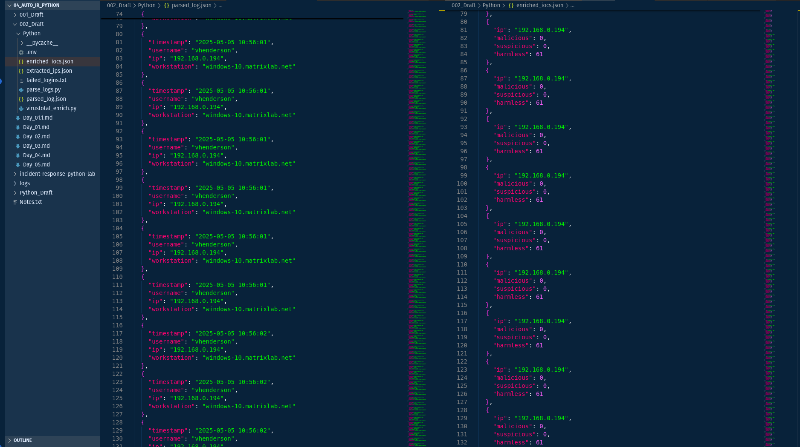

# **Day 4: Alert Report Generation**

## 🎯 Objective

1. Merge and enrich **parsed logs** + **VirusTotal results**
2. Generate alerts in **CSV and JSON** formats
3. Validate report structure and malicious indicators

---

## 📋 Prerequisites

✅ Finished [**Day 3: IOC Enrichment**](./day3_ioc-enrichment.md)
✅ `enriched_iocs.json` and `parsed_log.json` present
✅ Python + `pandas` installed:

```bash
pip install pandas
```

---

## 📝 Step-by-Step Guide


### 1️⃣ Input Files Preview

#### `enriched_iocs.json`

```json
[
  {
    "ip": "192.168.1.10",
    "malicious": 5,
    "suspicious": 2,
    "harmless": 62
  }
]
```

#### `parsed_log.json`

```json
[
  {
    "timestamp": "2025-07-03 14:32:00",
    "username": "admin",
    "ip": "192.168.1.10",
    "workstation": "DESKTOP-01"
  }
]
```



---

### 2️⃣ Create the Report Script

📁 Save as: `scripts/generate_report.py`

```python
import json
import csv
from datetime import datetime

# Load enriched IOCs and parsed logs
with open("enriched_iocs.json", "r") as f:
    enriched_data = json.load(f)

with open("parsed_log.json", "r") as f:
    parsed_log = json.load(f)

# Merge data by IP
def merge_data(parsed_log, enriched_data):
    reports = []
    for log in parsed_log:
        ip = log.get("ip")
        if not ip:
            continue
        enriched_entry = next((entry for entry in enriched_data if entry["ip"] == ip), None)
        if enriched_entry:
            report = {
                "timestamp": log["timestamp"],
                "username": log["username"],
                "ip": ip,
                "workstation": log["workstation"],
                "vt_malicious_count": enriched_entry["malicious"]
            }
            reports.append(report)
    return reports

# Save as CSV
def save_to_csv(reports, filename="alerts.csv"):
    with open(filename, "w", newline="") as f:
        writer = csv.DictWriter(f, fieldnames=reports[0].keys())
        writer.writeheader()
        writer.writerows(reports)

# Save as JSON
def save_to_json(reports, filename="alerts.json"):
    with open(filename, "w") as f:
        json.dump(reports, f, indent=2)

if __name__ == "__main__":
    reports = merge_data(parsed_log, enriched_data)
    
    if reports:
        save_to_csv(reports)
        save_to_json(reports)
        print(f"✅ Generated {len(reports)} alerts.")
    else:
        print("⚠️ No alerts to report.")
```


---

### 3️⃣ Output Examples

#### `alerts.csv`

```csv
timestamp,username,ip,workstation,vt_malicious_count
2025-07-03 14:32:00,admin,192.168.1.10,DESKTOP-01,5
```

#### `alerts.json`

```json
[
  {
    "timestamp": "2025-07-03 14:32:00",
    "username": "admin",
    "ip": "192.168.1.10",
    "workstation": "DESKTOP-01",
    "vt_malicious_count": 5
  }
]
```
---

### 4️⃣ Report Validation

#### A. Validate CSV with Pandas

```python
import pandas as pd

df = pd.read_csv("reports/alerts.csv")
print(df.head())
```

#### B. Validate JSON

```python
import json

with open("reports/alerts.json") as f:
    data = json.load(f)
    print(json.dumps(data, indent=2))
```
---

### ✅ Verification Checklist

| Check | Description                               |
| ----- | ----------------------------------------- |
| ✅     | Script runs without errors                |
| ✅     | Output files created in `reports/` folder |
| ✅     | Timestamps and fields are well formatted  |
| ✅     | Handles empty or missing data gracefully  |

---

## 🔗 References

* [Python `csv` Module Docs](https://docs.python.org/3/library/csv.html)
* [Pandas `read_csv`](https://pandas.pydata.org/docs/reference/api/pandas.read_csv.html)

